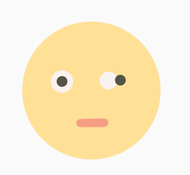

# LottieFlutter

Lottie-Flutter is based on [Lottie-Android](https://github.com/airbnb/lottie-android)

Lottie is a mobile library that parses [Adobe After Effects](http://www.adobe.com/products/aftereffects.html) animations exported as json with [Bodymovin](https://github.com/bodymovin/bodymovin) and renders them natively on mobile!

### Current status

### Waiting for...

    - [ ] PathMeasure [#10428](https://github.com/flutter/flutter/issues/10428)  ★★★★★
    - [ ] Path.add(path, matrix) ★★★★★
    - [ ] Path JoinType    [#7199](https://github.com/flutter/flutter/issues/7199)  ★★★
    - [ ] Path.computeBounds   ★★
    - [ ] Path Operations      ★★
    - [ ] DashPathEffect [#9641](https://github.com/flutter/flutter/issues/9641)  ★
    - [ ] Canvas.getClipBounds   ★
    - [ ] Canvas.clipRect(_, Region.Op) ★

